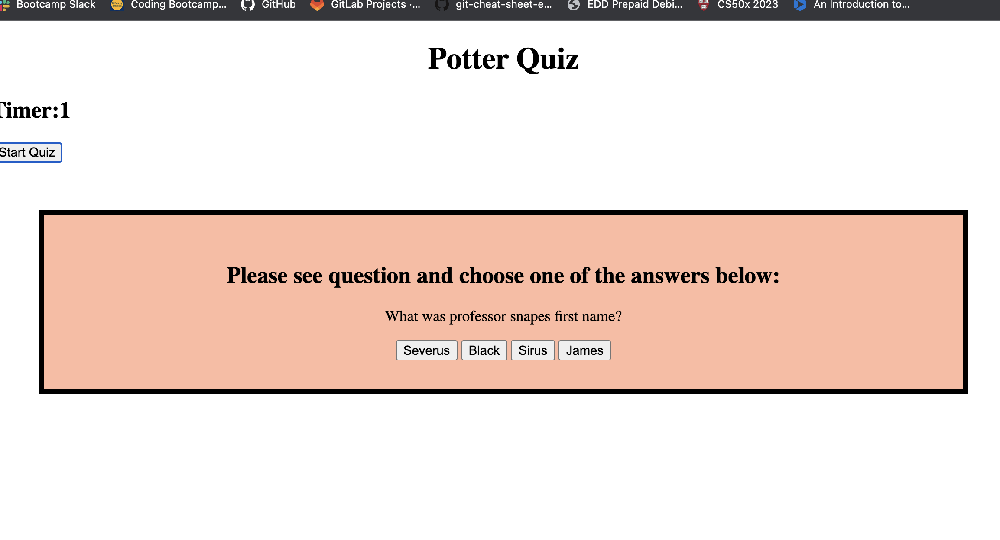

# Quizz Application
The assigment is to create a multiple choice quiz that is timed. 
Using HTML, CSS but mainly working with JS to target classes, attributes and IDs.
## Progress
So far have created the layout and structure of the quiz including questions and starter code.
Worked with Johnny (TA) to target the correct classes and ids to render the first question. also got better guidance on how to work the logic for this app. 
Worked with a tutor alexis, to help cycle through questions and add the time interval
have added small details regarding correct and wrong display as well as tried to solve all the issues on my own.
Created a box to save initials and have been trying to get the timer to stop at zero.

# Questions
how to stop setinterval at zero and once it does, end game aka remove mainbox again
immediatly display conrgrats, final score and save initials box which is in CSS
Prompt to put up in order to inout initials and save final score.
if statements for when answers are correct to log a point. 
need to render a page for final score
final score must be saved.

### Links and Screenshots
Github: https://github.com/escotoj/QuizApp
Deployed App: https://escotoj.github.io/QuizApp/

